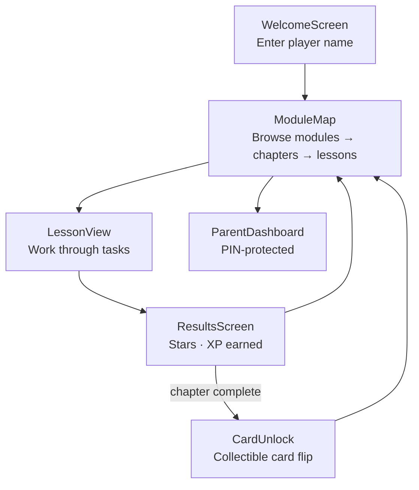
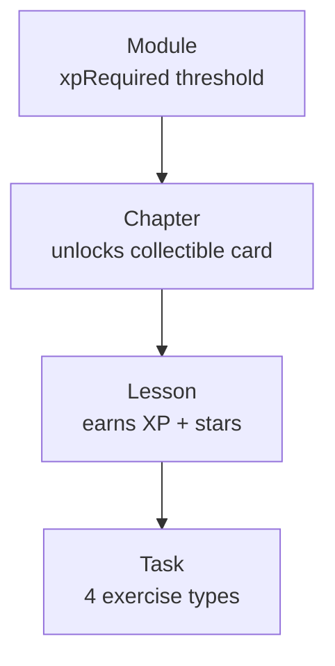
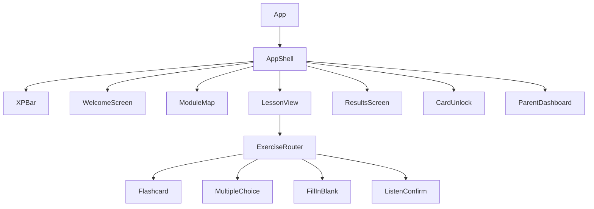
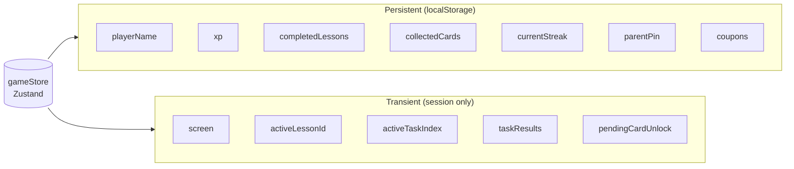
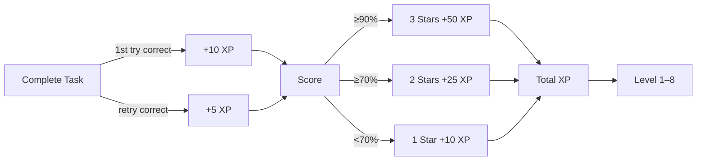
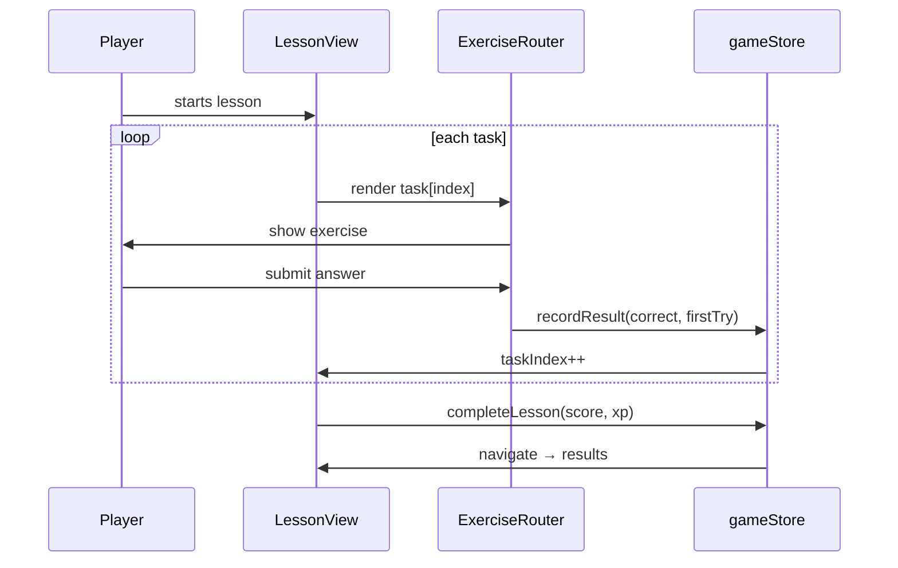

# DeutschForJay — Architecture

A gamified, offline-first German learning app for kids. No backend — fully client-side with localStorage persistence.

---

## Tech Stack

| Layer | Technology |
|---|---|
| UI | React 18 + TypeScript |
| State | Zustand (localStorage persistence) |
| Styling | Tailwind CSS |
| Animation | Framer Motion |
| Speech | Web Speech API |
| Build | Vite |
| Data | Static JSON files |

---

## Screen Flow



---

## Curriculum Data Hierarchy



**Task types:** `flashcard` · `multiple-choice` · `fill-in-blank` · `listen-confirm`

---

## Component Tree



---

## State Management

All state lives in a single Zustand store (`gameStore.ts`).



---

## XP & Progression



**Levels:** Rookie (0) → Ball Boy (100) → Midfielder (300) → Striker (600) → Captain (1000) → Pro Player (1500) → World Class (2500) → Legend (4000)

---

## Lesson Task Loop



---

## Key Files

```
src/
├── App.tsx                   # Screen router (state-based, no React Router)
├── store/gameStore.ts        # All app state + actions
├── types/curriculum.ts       # TypeScript interfaces for all data shapes
├── services/curriculum.ts    # Query helpers for JSON curriculum data
├── hooks/useTTS.ts           # Web Speech API wrapper (de-DE / en-US)
├── curriculum/
│   ├── module-01.json        # Greetings & Basics
│   └── module-02.json        # Module 2
└── components/
    ├── layout/               # Full-screen views (Map, Lesson, Results, …)
    ├── exercises/            # Task components + router
    ├── rewards/              # XPBar, CardUnlock
    └── parent/               # ParentDashboard
```
