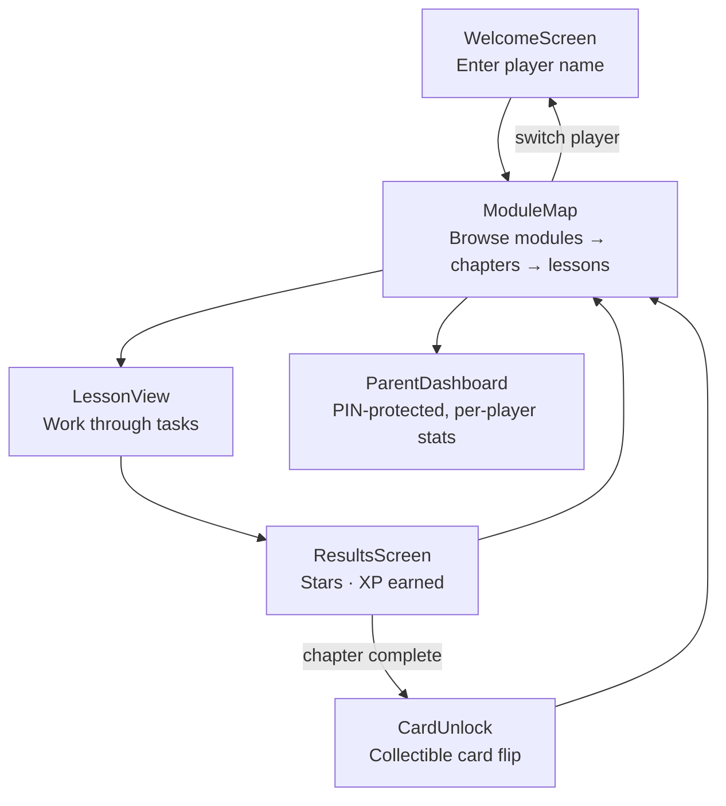
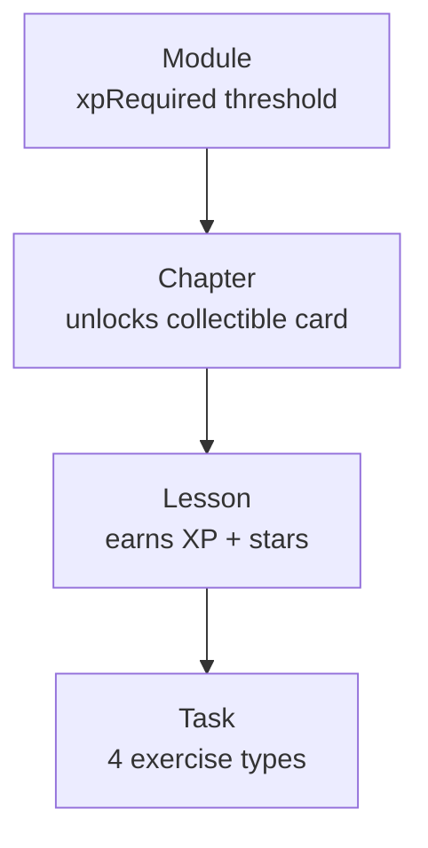
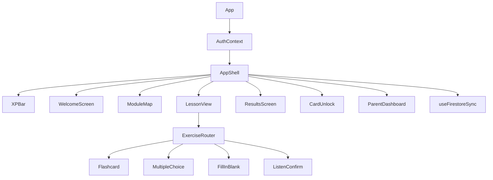
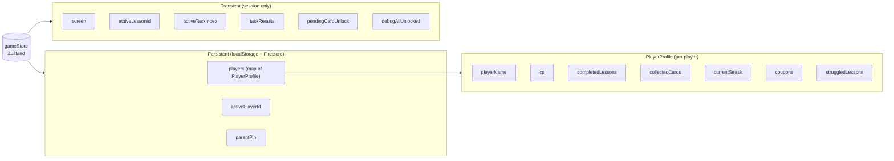
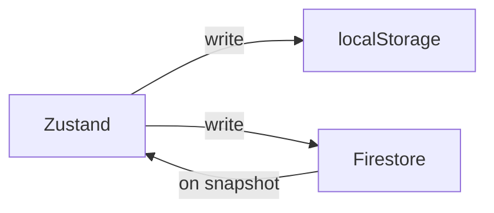
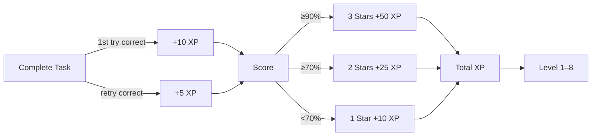
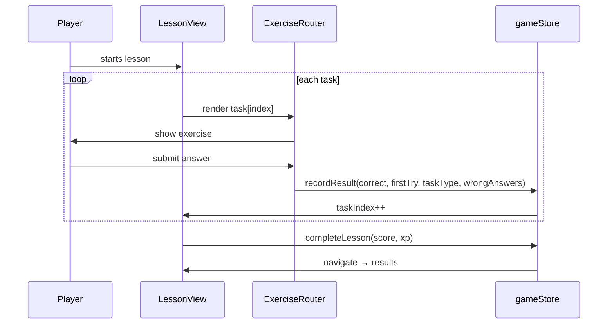

# DeutschForJay — Architecture

A gamified German learning app for kids. Offline-first with localStorage persistence, optional cloud sync via Firebase Auth + Firestore. Supports multiple player profiles per device.

---

## Tech Stack

| Layer | Technology |
|---|---|
| UI | React 18 + TypeScript |
| State | Zustand (localStorage persistence) |
| Cloud Sync | Firebase Auth (Google) + Firestore |
| Styling | Tailwind CSS |
| Animation | Framer Motion |
| Speech | Web Speech API |
| Build | Vite |
| Data | Static JSON files (auto-discovered via import.meta.glob) |
| Tooling | tsx, firebase-admin (scripts) |

---

## Screen Flow



---

## Curriculum Data Hierarchy



**Task types:** `flashcard` · `multiple-choice` · `fill-in-blank` · `listen-confirm`

---

## Component Tree



---

## State Management

All state lives in a single Zustand store (`gameStore.ts`). Multi-player profiles are stored as a `players` map keyed by player ID, with one active player at a time.



### Cloud Sync

When signed in with Google, `useFirestoreSync` bidirectionally syncs the Zustand store with a Firestore document (`users/{uid}`). localStorage remains the source of truth for offline use; Firestore merges on reconnect.



---

## XP & Progression



**Levels:** Rookie (0) → Ball Boy (100) → Midfielder (300) → Striker (600) → Captain (1000) → Pro Player (1500) → World Class (2500) → Legend (4000)

---

## Lesson Task Loop



---

## Key Files

```
src/
├── App.tsx                   # Screen router (state-based, no React Router)
├── store/gameStore.ts        # All app state + actions (multi-player)
├── types/curriculum.ts       # TypeScript interfaces for all data shapes
├── services/
│   ├── curriculum.ts         # Query helpers (auto-discovers module JSON via import.meta.glob)
│   ├── firebase.ts           # Firebase app init, auth & Firestore exports
│   ├── firestoreSync.ts      # Read/write player data to Firestore
│   └── AuthContext.tsx        # React context for Google sign-in state
├── hooks/
│   ├── useTTS.ts             # Web Speech API wrapper (de-DE / en-US)
│   └── useFirestoreSync.ts   # Zustand ↔ Firestore bidirectional sync
├── curriculum/
│   ├── module-01.json        # Hallo! Greetings & Basics
│   ├── module-02.json        # Die Familie
│   ├── module-03.json        # In der Schule
│   ├── module-04.json        # Essen & Trinken
│   ├── module-05.json        # Sport & Hobbys
│   └── module-06.json        # In der Stadt
└── components/
    ├── layout/               # Full-screen views (Map, Lesson, Results, …)
    ├── exercises/            # Task components + router (tracks wrong answers per task)
    ├── rewards/              # XPBar, CardUnlock
    └── parent/               # ParentDashboard (per-player, unlock-all toggle)
scripts/
└── fetch-student-data.ts     # Firestore → JSON export for AI curriculum generation
```

## Curriculum Generation Pipeline

New modules can be generated via the Claude Code slash command `/generate-module <topic>`. The pipeline:

1. `scripts/fetch-student-data.ts` pulls per-task performance data from Firestore (wrong answers, struggle patterns)
2. The AI reads all existing modules to avoid vocabulary duplication
3. A new `module-XX.json` is generated with struggle-aware reinforcement
4. The file is auto-discovered by `curriculum.ts` — no import changes needed
